# UML Use Case - Split Diagrams

Quy uoc:

- Moi so do la 1 luong chinh rieng.
- Actor nam ben trai va chi noi den use case chinh.
- Use case chinh nam o giua.
- Use case phu nam ben phai, noi tu use case chinh bang `<<include>>` hoac `<<extend>>`.
- Tat ca duong noi ep huong ngang trai sang phai bang `-right-` va `-right->`.

## 1. User - Manage Account

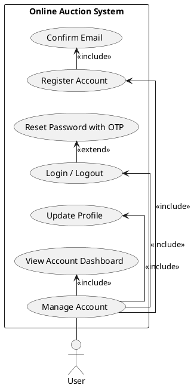

## 2. User - Browse Marketplace

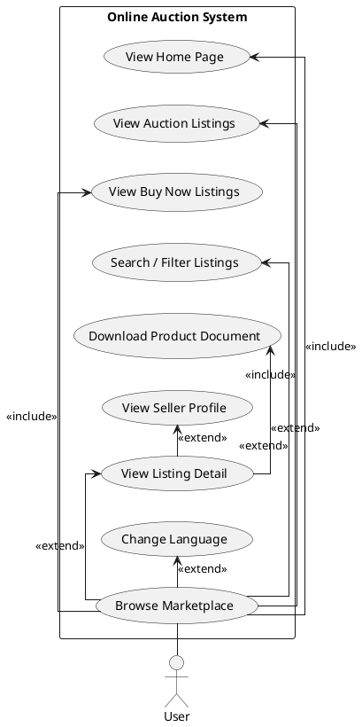

## 3. User - Participate In Auction

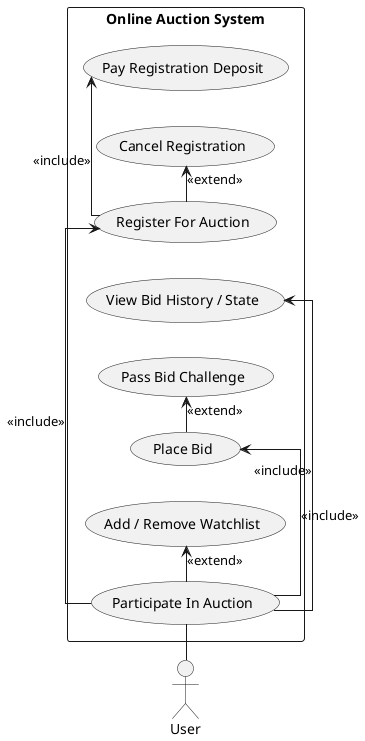

## 4. User - Purchase Product

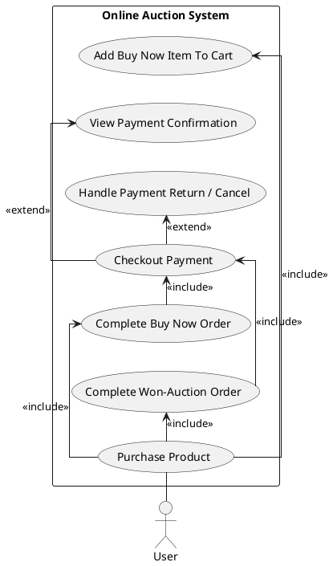

## 5. User - Manage Own Listings

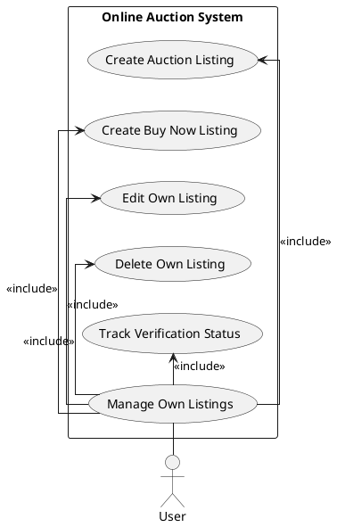

## 6. User - Manage Personal Activity

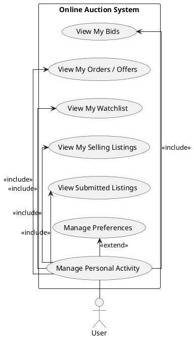

## 7. User - Notifications And Complaints

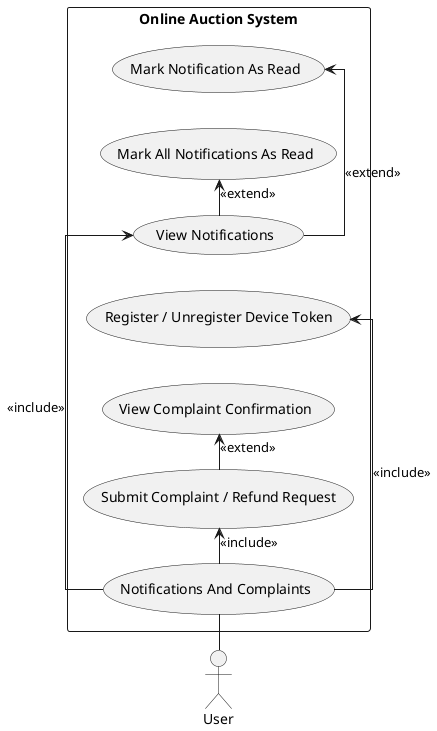

## 8. Admin - Authentication

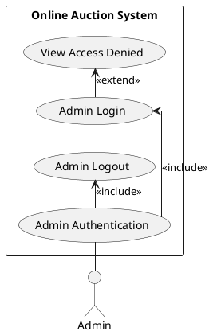

## 9. Admin - Dashboard And Reports

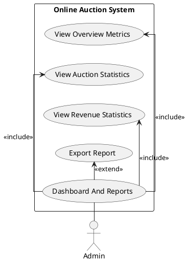

## 10. Admin - Manage Users And Permissions

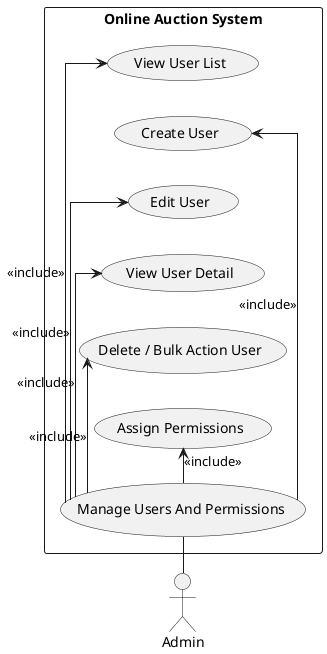

## 11. Admin - Manage Catalog

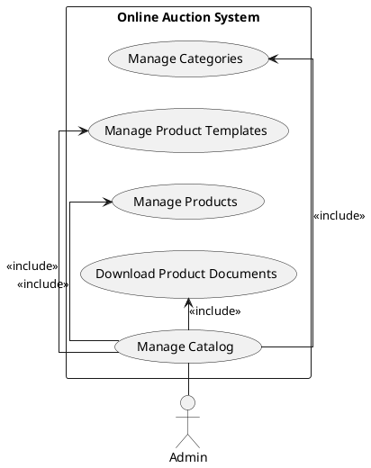

## 12. Admin - Manage Auctions

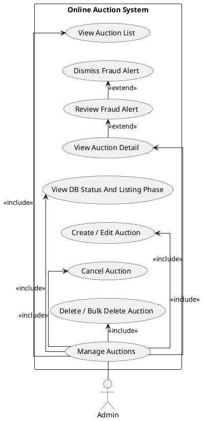

## 13. Admin - Verify Listings

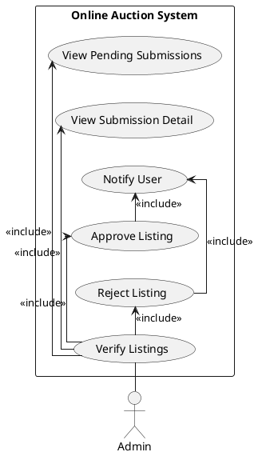

## 14. Admin - Manage Buy Now

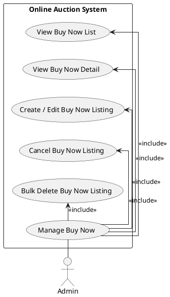

## 15. Admin - Handle Complaints And Refunds

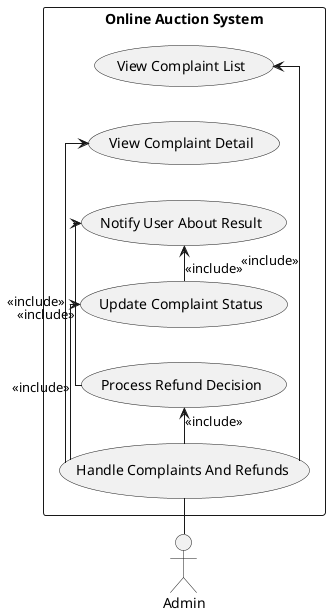

