# UML Use Case chuan - Online Auction

File nay gom use case theo dung nguyen tac:

- `User` va `Admin` la actor chinh.
- Actor chi noi toi use case luong chinh.
- Chuc nang con khong noi truc tiep voi actor.
- Luong bat buoc dung `<<include>>`.
- Luong tuy chon hoac phat sinh theo dieu kien dung `<<extend>>`.
- Moi luong chinh duoc dat trong mot package rieng de de nhin.

## PlantUML

```plantuml
@startuml
left to right direction
skinparam linetype ortho
skinparam packageStyle rectangle
skinparam shadowing false
skinparam nodesep 45
skinparam ranksep 60

actor User
actor Admin

rectangle "Online Auction System" {

  package "USER - Manage Account" {
    usecase "Manage Account" as U_Account
    usecase "Register Account" as U_Register
    usecase "Confirm Email" as U_ConfirmEmail
    usecase "Login / Logout" as U_LoginLogout
    usecase "Reset Password with OTP" as U_ResetPassword
    usecase "Update Profile" as U_UpdateProfile
    usecase "View Account Dashboard" as U_AccountDashboard
  }

  package "USER - Browse Marketplace" {
    usecase "Browse Marketplace" as U_Browse
    usecase "View Home Page" as U_Home
    usecase "View Auction Listings" as U_AuctionList
    usecase "View Buy Now Listings" as U_BuyNowList
    usecase "Search / Filter Listings" as U_SearchFilter
    usecase "View Listing Detail" as U_ListingDetail
    usecase "Download Product Document" as U_DownloadDocument
    usecase "View Seller Profile" as U_SellerProfile
    usecase "Change Language" as U_ChangeLanguage
  }

  package "USER - Participate In Auction" {
    usecase "Participate In Auction" as U_AuctionFlow
    usecase "Register For Auction" as U_RegisterAuction
    usecase "Pay Registration Deposit" as U_Deposit
    usecase "Cancel Registration" as U_CancelRegistration
    usecase "View Bid History / State" as U_BidState
    usecase "Place Bid" as U_PlaceBid
    usecase "Pass Bid Challenge" as U_BidChallenge
    usecase "Add / Remove Watchlist" as U_Watchlist
  }

  package "USER - Purchase Product" {
    usecase "Purchase Product" as U_Purchase
    usecase "Add Buy Now Item To Cart" as U_AddCart
    usecase "Complete Buy Now Order" as U_BuyNowOrder
    usecase "Complete Won-Auction Order" as U_WonAuctionOrder
    usecase "Checkout Payment" as U_Checkout
    usecase "View Payment Confirmation" as U_PaymentConfirm
    usecase "Handle Payment Return / Cancel" as U_PaymentReturn
  }

  package "USER - Manage Own Listings" {
    usecase "Manage Own Listings" as U_OwnListings
    usecase "Create Auction Listing" as U_CreateAuctionListing
    usecase "Create Buy Now Listing" as U_CreateBuyNowListing
    usecase "Edit Own Listing" as U_EditOwnListing
    usecase "Delete Own Listing" as U_DeleteOwnListing
    usecase "Track Verification Status" as U_TrackVerification
  }

  package "USER - Personal Activity" {
    usecase "Manage Personal Activity" as U_PersonalActivity
    usecase "View My Bids" as U_MyBids
    usecase "View My Orders / Offers" as U_MyOrders
    usecase "View My Watchlist" as U_MyWatchlist
    usecase "View My Selling Listings" as U_MySelling
    usecase "View Submitted Listings" as U_MySubmissions
    usecase "Manage Preferences" as U_Preferences
  }

  package "USER - Notifications And Complaints" {
    usecase "Notifications And Complaints" as U_NotifyComplaint
    usecase "View Notifications" as U_ViewNotifications
    usecase "Register / Unregister Device Token" as U_DeviceToken
    usecase "Mark Notification As Read" as U_MarkRead
    usecase "Mark All Notifications As Read" as U_MarkAllRead
    usecase "Submit Complaint / Refund Request" as U_SubmitComplaint
    usecase "View Complaint Confirmation" as U_ComplaintConfirm
  }

  package "ADMIN - Authentication" {
    usecase "Admin Authentication" as A_Auth
    usecase "Admin Login" as A_Login
    usecase "Admin Logout" as A_Logout
    usecase "View Access Denied" as A_AccessDenied
  }

  package "ADMIN - Dashboard And Reports" {
    usecase "Dashboard And Reports" as A_Dashboard
    usecase "View Overview Metrics" as A_Overview
    usecase "View Auction Statistics" as A_AuctionStats
    usecase "View Revenue Statistics" as A_RevenueStats
    usecase "Export Report" as A_ExportReport
  }

  package "ADMIN - Users And Permissions" {
    usecase "Manage Users And Permissions" as A_UserPermission
    usecase "View User List" as A_UserList
    usecase "Create User" as A_CreateUser
    usecase "Edit User" as A_EditUser
    usecase "View User Detail" as A_UserDetail
    usecase "Delete / Bulk Action User" as A_DeleteUser
    usecase "Assign Permissions" as A_AssignPermission
  }

  package "ADMIN - Catalog" {
    usecase "Manage Catalog" as A_Catalog
    usecase "Manage Categories" as A_Category
    usecase "Manage Product Templates" as A_Template
    usecase "Manage Products" as A_Product
    usecase "Download Product Documents" as A_DownloadDocument
  }

  package "ADMIN - Auctions" {
    usecase "Manage Auctions" as A_Auction
    usecase "View Auction List" as A_AuctionList
    usecase "View Auction Detail" as A_AuctionDetail
    usecase "View DB Status And Listing Phase" as A_AuctionPhase
    usecase "Create / Edit Auction" as A_CreateEditAuction
    usecase "Cancel Auction" as A_CancelAuction
    usecase "Delete / Bulk Delete Auction" as A_DeleteAuction
    usecase "Review Fraud Alert" as A_FraudAlert
    usecase "Dismiss Fraud Alert" as A_DismissFraud
  }

  package "ADMIN - Verify Listings" {
    usecase "Verify Listings" as A_Verify
    usecase "View Pending Submissions" as A_PendingSubmission
    usecase "View Submission Detail" as A_SubmissionDetail
    usecase "Approve Listing" as A_ApproveListing
    usecase "Reject Listing" as A_RejectListing
    usecase "Notify User" as A_NotifyUser
  }

  package "ADMIN - Buy Now" {
    usecase "Manage Buy Now" as A_BuyNow
    usecase "View Buy Now List" as A_BuyNowList
    usecase "View Buy Now Detail" as A_BuyNowDetail
    usecase "Create / Edit Buy Now Listing" as A_CreateEditBuyNow
    usecase "Cancel Buy Now Listing" as A_CancelBuyNow
    usecase "Bulk Delete Buy Now Listing" as A_BulkDeleteBuyNow
  }

  package "ADMIN - Complaints And Refunds" {
    usecase "Handle Complaints And Refunds" as A_Complaint
    usecase "View Complaint List" as A_ComplaintList
    usecase "View Complaint Detail" as A_ComplaintDetail
    usecase "Update Complaint Status" as A_UpdateComplaint
    usecase "Process Refund Decision" as A_RefundDecision
    usecase "Notify User About Result" as A_NotifyComplaintResult
  }
}

' Actor chi noi toi luong chinh
User -- U_Account
User -- U_Browse
User -- U_AuctionFlow
User -- U_Purchase
User -- U_OwnListings
User -- U_PersonalActivity
User -- U_NotifyComplaint

Admin -- A_Auth
Admin -- A_Dashboard
Admin -- A_UserPermission
Admin -- A_Catalog
Admin -- A_Auction
Admin -- A_Verify
Admin -- A_BuyNow
Admin -- A_Complaint

' USER - Manage Account
U_Account .> U_Register : <<include>>
U_Register .> U_ConfirmEmail : <<include>>
U_Account .> U_LoginLogout : <<include>>
U_ResetPassword .> U_LoginLogout : <<extend>>
U_Account .> U_UpdateProfile : <<include>>
U_Account .> U_AccountDashboard : <<include>>

' USER - Browse Marketplace
U_Browse .> U_Home : <<include>>
U_Browse .> U_AuctionList : <<include>>
U_Browse .> U_BuyNowList : <<include>>
U_SearchFilter .> U_Browse : <<extend>>
U_ListingDetail .> U_Browse : <<extend>>
U_DownloadDocument .> U_ListingDetail : <<extend>>
U_SellerProfile .> U_ListingDetail : <<extend>>
U_ChangeLanguage .> U_Browse : <<extend>>

' USER - Participate In Auction
U_AuctionFlow .> U_RegisterAuction : <<include>>
U_RegisterAuction .> U_Deposit : <<include>>
U_CancelRegistration .> U_RegisterAuction : <<extend>>
U_AuctionFlow .> U_BidState : <<include>>
U_AuctionFlow .> U_PlaceBid : <<include>>
U_BidChallenge .> U_PlaceBid : <<extend>>
U_Watchlist .> U_AuctionFlow : <<extend>>

' USER - Purchase Product
U_Purchase .> U_AddCart : <<include>>
U_Purchase .> U_BuyNowOrder : <<include>>
U_Purchase .> U_WonAuctionOrder : <<include>>
U_BuyNowOrder .> U_Checkout : <<include>>
U_WonAuctionOrder .> U_Checkout : <<include>>
U_PaymentConfirm .> U_Checkout : <<extend>>
U_PaymentReturn .> U_Checkout : <<extend>>

' USER - Manage Own Listings
U_OwnListings .> U_CreateAuctionListing : <<include>>
U_OwnListings .> U_CreateBuyNowListing : <<include>>
U_OwnListings .> U_EditOwnListing : <<include>>
U_OwnListings .> U_DeleteOwnListing : <<include>>
U_OwnListings .> U_TrackVerification : <<include>>

' USER - Personal Activity
U_PersonalActivity .> U_MyBids : <<include>>
U_PersonalActivity .> U_MyOrders : <<include>>
U_PersonalActivity .> U_MyWatchlist : <<include>>
U_PersonalActivity .> U_MySelling : <<include>>
U_PersonalActivity .> U_MySubmissions : <<include>>
U_Preferences .> U_PersonalActivity : <<extend>>

' USER - Notifications And Complaints
U_NotifyComplaint .> U_ViewNotifications : <<include>>
U_NotifyComplaint .> U_DeviceToken : <<include>>
U_MarkRead .> U_ViewNotifications : <<extend>>
U_MarkAllRead .> U_ViewNotifications : <<extend>>
U_NotifyComplaint .> U_SubmitComplaint : <<include>>
U_ComplaintConfirm .> U_SubmitComplaint : <<extend>>

' ADMIN - Authentication
A_Auth .> A_Login : <<include>>
A_Auth .> A_Logout : <<include>>
A_AccessDenied .> A_Login : <<extend>>

' ADMIN - Dashboard And Reports
A_Dashboard .> A_Overview : <<include>>
A_Dashboard .> A_AuctionStats : <<include>>
A_Dashboard .> A_RevenueStats : <<include>>
A_ExportReport .> A_Dashboard : <<extend>>

' ADMIN - Users And Permissions
A_UserPermission .> A_UserList : <<include>>
A_UserPermission .> A_CreateUser : <<include>>
A_UserPermission .> A_EditUser : <<include>>
A_UserPermission .> A_UserDetail : <<include>>
A_UserPermission .> A_DeleteUser : <<include>>
A_UserPermission .> A_AssignPermission : <<include>>

' ADMIN - Catalog
A_Catalog .> A_Category : <<include>>
A_Catalog .> A_Template : <<include>>
A_Catalog .> A_Product : <<include>>
A_Catalog .> A_DownloadDocument : <<include>>

' ADMIN - Auctions
A_Auction .> A_AuctionList : <<include>>
A_Auction .> A_AuctionDetail : <<include>>
A_Auction .> A_AuctionPhase : <<include>>
A_Auction .> A_CreateEditAuction : <<include>>
A_Auction .> A_CancelAuction : <<include>>
A_Auction .> A_DeleteAuction : <<include>>
A_FraudAlert .> A_AuctionDetail : <<extend>>
A_DismissFraud .> A_FraudAlert : <<extend>>

' ADMIN - Verify Listings
A_Verify .> A_PendingSubmission : <<include>>
A_Verify .> A_SubmissionDetail : <<include>>
A_Verify .> A_ApproveListing : <<include>>
A_Verify .> A_RejectListing : <<include>>
A_ApproveListing .> A_NotifyUser : <<include>>
A_RejectListing .> A_NotifyUser : <<include>>

' ADMIN - Buy Now
A_BuyNow .> A_BuyNowList : <<include>>
A_BuyNow .> A_BuyNowDetail : <<include>>
A_BuyNow .> A_CreateEditBuyNow : <<include>>
A_BuyNow .> A_CancelBuyNow : <<include>>
A_BuyNow .> A_BulkDeleteBuyNow : <<include>>

' ADMIN - Complaints And Refunds
A_Complaint .> A_ComplaintList : <<include>>
A_Complaint .> A_ComplaintDetail : <<include>>
A_Complaint .> A_UpdateComplaint : <<include>>
A_Complaint .> A_RefundDecision : <<include>>
A_UpdateComplaint .> A_NotifyComplaintResult : <<include>>
A_RefundDecision .> A_NotifyComplaintResult : <<include>>

@enduml
```

## Mapping nhanh theo code

- User: `AuthController`, `AccountController`, `AuctionController`, `BuyNowController`, `OrderController`, `PaymentController`, `SellController`, `UserAuctionController`, `WatchlistController`, `NotificationController`, `RefundController`.
- Admin: `Areas/Admin/Controllers/AccountController`, `DashboardController`, `UserController`, `PermissionController`, `CategoryController`, `ProductController`, `AuctionController`, `AuctionVerificationController`, `BuyNowController`, `ComplaintController`.
