# Online Auction Use Case Diagram

This document summarizes the main use cases found from the ASP.NET MVC controllers and services in the project.

## Actors

- Visitor: unauthenticated user browsing public pages.
- User: authenticated buyer/account owner.
- Seller: authenticated user managing their own listings.
- Admin: back-office operator with permission-based access.
- PayPal: external payment gateway for checkout and auction deposits.
- Email/Firebase: external notification delivery channels.

## PlantUML

Render this block with PlantUML.

```plantuml
@startuml
left to right direction
skinparam packageStyle rectangle

actor Visitor
actor User
actor Seller
actor Admin
actor PayPal
actor "Email/Firebase" as NotifyProvider

User --|> Visitor
Seller --|> User

rectangle "Online Auction Platform" {
  package "Public Marketplace" {
    usecase "Browse home page" as UC_Home
    usecase "Browse auction listings" as UC_AuctionList
    usecase "View auction detail" as UC_AuctionDetail
    usecase "View bid history/state" as UC_BidState
    usecase "Browse Buy Now listings" as UC_BuyNowList
    usecase "View Buy Now detail" as UC_BuyNowDetail
    usecase "Download product document" as UC_DownloadDoc
    usecase "View seller profile" as UC_ViewSeller
    usecase "Read static pages" as UC_Static
    usecase "Change language" as UC_Language
  }

  package "Authentication and Account" {
    usecase "Sign up" as UC_SignUp
    usecase "Confirm email" as UC_ConfirmEmail
    usecase "Log in" as UC_Login
    usecase "Log out" as UC_Logout
    usecase "Reset password with OTP" as UC_ResetPassword
    usecase "View account dashboard" as UC_Account
    usecase "View bids" as UC_AccountBids
    usecase "View watchlist" as UC_AccountWatchlist
    usecase "View offers/orders" as UC_AccountOrders
    usecase "View selling/submissions" as UC_AccountSelling
  }

  package "Auction Buyer Flow" {
    usecase "Register for auction" as UC_RegisterAuction
    usecase "Initiate registration deposit" as UC_Deposit
    usecase "Cancel registration" as UC_CancelRegistration
    usecase "Place bid" as UC_PlaceBid
    usecase "Pass bid challenge" as UC_BidChallenge
    usecase "Add/remove watchlist item" as UC_Watchlist
    usecase "Complete won-auction order" as UC_CompleteOrder
    usecase "Checkout with PayPal" as UC_PayPalCheckout
    usecase "View payment confirmation" as UC_PaymentConfirmation
    usecase "Submit refund/complaint request" as UC_Refund
  }

  package "Buy Now Buyer Flow" {
    usecase "Add Buy Now item to cart" as UC_AddCart
    usecase "Complete Buy Now order" as UC_BuyNowOrder
  }

  package "Seller Flow" {
    usecase "Create auction listing" as UC_CreateAuction
    usecase "Create Buy Now listing" as UC_CreateBuyNow
    usecase "Edit own listing" as UC_EditOwnListing
    usecase "Delete own listing" as UC_DeleteOwnListing
    usecase "Track submitted listings" as UC_TrackSubmissions
  }

  package "Notifications" {
    usecase "View notifications" as UC_ViewNotifications
    usecase "Register device token" as UC_RegisterDevice
    usecase "Mark notifications as read" as UC_MarkNotifications
    usecase "Send user/admin notification" as UC_SendNotification
  }

  package "Admin Back Office" {
    usecase "Admin login/logout" as UC_AdminAuth
    usecase "View dashboard and export reports" as UC_AdminDashboard
    usecase "Manage users" as UC_AdminUsers
    usecase "Manage categories" as UC_AdminCategories
    usecase "Manage product catalog/templates" as UC_AdminProducts
    usecase "Manage auctions" as UC_AdminAuctions
    usecase "View DB status and listing phase" as UC_AdminAuctionPhase
    usecase "Verify auction submissions" as UC_VerifyAuctions
    usecase "Manage Buy Now listings" as UC_AdminBuyNow
    usecase "Review complaints/refunds" as UC_AdminComplaints
    usecase "Manage permissions" as UC_AdminPermissions
    usecase "Review fraud alerts" as UC_FraudAlerts
    usecase "Refund registration deposit" as UC_RefundDeposit
  }

  package "Background Processing" {
    usecase "Finalize expired auctions" as UC_FinalizeAuctions
    usecase "Cancel expired pending orders" as UC_CancelExpiredOrders
    usecase "Detect bid fraud" as UC_DetectFraud
    usecase "Recover winner non-payment" as UC_NonPayment
  }
}

Visitor --> UC_Home
Visitor --> UC_AuctionList
Visitor --> UC_AuctionDetail
Visitor --> UC_BidState
Visitor --> UC_BuyNowList
Visitor --> UC_BuyNowDetail
Visitor --> UC_DownloadDoc
Visitor --> UC_ViewSeller
Visitor --> UC_Static
Visitor --> UC_Language
Visitor --> UC_SignUp
Visitor --> UC_Login
Visitor --> UC_ResetPassword

User --> UC_Logout
User --> UC_Account
User --> UC_AccountBids
User --> UC_AccountWatchlist
User --> UC_AccountOrders
User --> UC_AccountSelling
User --> UC_RegisterAuction
User --> UC_Deposit
User --> UC_CancelRegistration
User --> UC_PlaceBid
User --> UC_Watchlist
User --> UC_AddCart
User --> UC_CompleteOrder
User --> UC_BuyNowOrder
User --> UC_PaymentConfirmation
User --> UC_Refund
User --> UC_ViewNotifications
User --> UC_RegisterDevice
User --> UC_MarkNotifications

Seller --> UC_CreateAuction
Seller --> UC_CreateBuyNow
Seller --> UC_EditOwnListing
Seller --> UC_DeleteOwnListing
Seller --> UC_TrackSubmissions

Admin --> UC_AdminAuth
Admin --> UC_AdminDashboard
Admin --> UC_AdminUsers
Admin --> UC_AdminCategories
Admin --> UC_AdminProducts
Admin --> UC_AdminAuctions
Admin --> UC_VerifyAuctions
Admin --> UC_AdminBuyNow
Admin --> UC_AdminComplaints
Admin --> UC_AdminPermissions
Admin --> UC_FraudAlerts
Admin --> UC_RefundDeposit

UC_SignUp ..> UC_ConfirmEmail : <<include>>
UC_RegisterAuction ..> UC_Deposit : <<include when deposit required>>
UC_Deposit ..> UC_PayPalCheckout : <<include>>
UC_CompleteOrder ..> UC_PayPalCheckout : <<include>>
UC_BuyNowOrder ..> UC_PayPalCheckout : <<include>>
UC_PlaceBid ..> UC_BidChallenge : <<extend when suspicious>>
UC_PlaceBid ..> UC_DetectFraud : <<include>>
UC_AdminAuctions ..> UC_AdminAuctionPhase : <<include>>
UC_AdminAuctions ..> UC_FraudAlerts : <<extend>>
UC_VerifyAuctions ..> UC_SendNotification : <<include>>
UC_AdminComplaints ..> UC_SendNotification : <<include>>
UC_FinalizeAuctions ..> UC_NonPayment : <<extend>>
UC_SendNotification --> NotifyProvider
UC_PayPalCheckout --> PayPal
PayPal --> UC_PaymentConfirmation

@enduml
```

## Scope Notes

- Admin permissions are enforced by `RequirePermission` on admin controllers.
- User-only flows use `AuthSchemes.User`; admin-only flows use `AuthSchemes.Admin`.
- Auction listing phase is computed, not stored, and is shown in Admin Auction management alongside the persisted DB status.
- PayPal is used for registration deposits and order checkout.
- Background services handle finalization, expired pending orders, fraud detection, and winner non-payment recovery.

